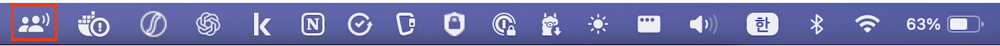
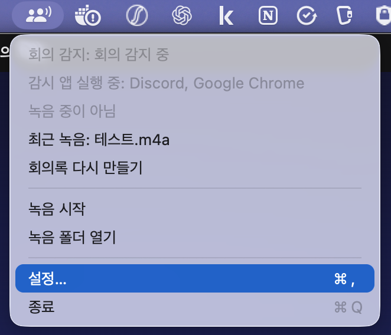
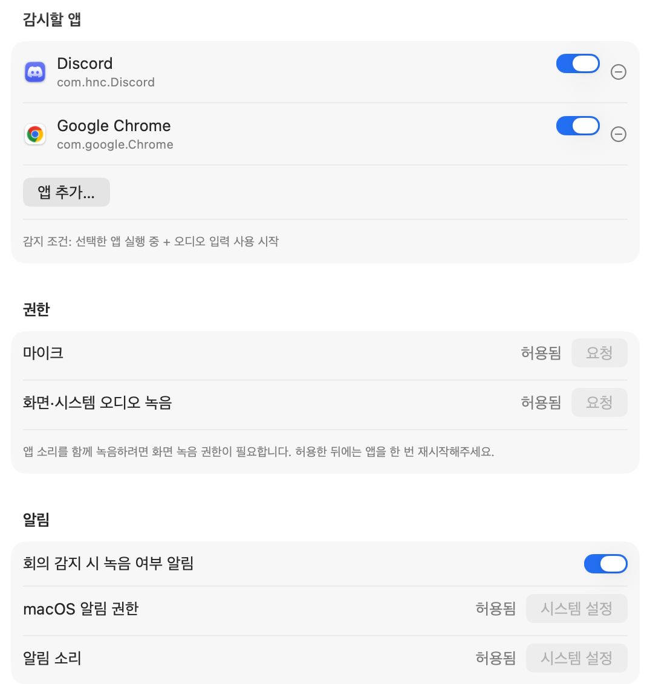
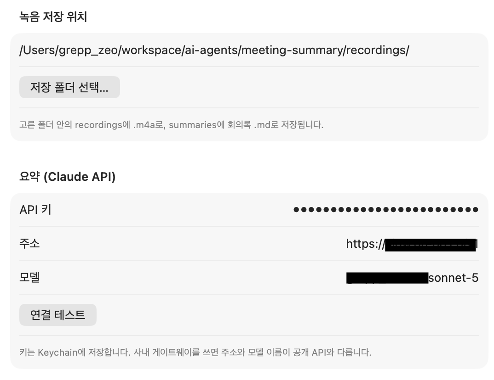
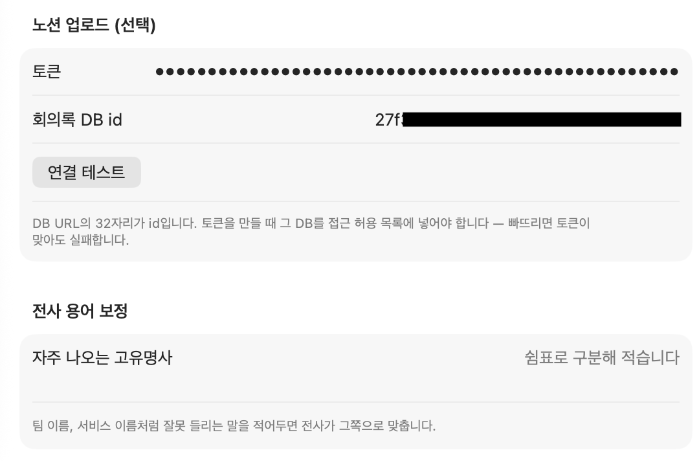

# meeting-summary

**회의를 녹음하면 회의록이 나옵니다.** 메뉴바 앱 하나로 녹음·전사·요약을 다 합니다.

https://github.com/user-attachments/assets/a1594762-e2b7-4f60-867a-ad22319dd2a9

## 이게 뭔가

메뉴바에서 **녹음 시작**을 누르고 회의를 하면, 끝난 뒤 이런 게 생깁니다.

```
recordings/   회의 녹음      .m4a
transcripts/  받아쓴 전문    .txt
summaries/    회의록         .md    ← 요약·결정사항·액션 아이템
```

(선택) 노션 회의록 DB에 페이지로도 올려줍니다.

### 내 소리는 어디로 가나

팀 회의를 녹음하는 도구라 먼저 밝힙니다.

| 무엇             | 어디로                                                                             |
| ---------------- | ---------------------------------------------------------------------------------- |
| 녹음 파일 `.m4a` | **Mac 밖으로 안 나갑니다.** 받아쓰기(WhisperKit)가 Mac에서 돕니다                  |
| 받아쓴 전문      | **요약할 때 Claude API로 전문이 전송됩니다.** 사내 게이트웨이를 쓰면 거기로 갑니다 |
| 회의록           | 노션 업로드를 켠 경우에만 노션으로 갑니다. 끄면 맥에만 남습니다                    |
| API 키·노션 토큰 | macOS Keychain. 파일이나 레포에 안 씁니다                                          |

녹음은 **화면 전체 소리 + 마이크**를 함께 받습니다. 어느 앱에서 회의가 열리든 잡히고,
그 시간 동안 맥에서 난 다른 소리도 같이 들어갑니다.

## 시작하기 전에 필요한 것

| 준비물                           | 설명                                                                                                                    |
| -------------------------------- | ----------------------------------------------------------------------------------------------------------------------- |
| Apple Silicon Mac, macOS 26 이상 | Intel 맥은 안 됩니다                                                                                                    |
| Claude API 키                    | 없으면 녹음과 받아쓰기까지만 되고 회의록이 안 나옵니다. 사내 게이트웨이를 쓴다면 **주소와 모델 이름**도 함께 받아두세요 |
| 여유 공간 2GB 정도               | 음성 인식 모델을 처음 한 번 받습니다                                                                                    |
| (선택) 노션 토큰과 회의록 DB id  | 회의록을 노션에도 올리고 싶을 때만                                                                                      |

Python도, 이 레포를 clone할 일도 없습니다. 앱 하나만 받으면 됩니다.

## 설치

### 1. 앱 받기

[Releases](https://github.com/zeo-grepp/meeting-summary/releases)에서 가장 최근 zip을 내려받아
풀고, `MeetingAssistant.app`을 `/Applications`에 넣습니다.

**넣은 다음 터미널에서 이 한 줄을 돌립니다.**

```sh
xattr -d com.apple.quarantine /Applications/MeetingAssistant.app
```

안 돌리면 앱을 열 때 "손상되었기 때문에 열 수 없습니다"라고 뜹니다. 앱이 망가진 게
아니라 Apple Developer ID 인증서가 아직 없어서 나는 경고입니다
([#6](https://github.com/zeo-grepp/meeting-summary/issues/6)). 인증서가 생기면 사라질 단계입니다.

앱을 열어도 **Dock에는 안 뜹니다.** 메뉴바에 아이콘만 생깁니다.



### 2. 설정 채우기

메뉴바 아이콘 → 설정



**꼭 해야 하는 건 권한과 녹음 저장 위치, 요약 세 개입니다.** 나머지는 선택입니다.

#### 감시할 앱 (선택)

회의에 쓰는 통화 앱을 추가합니다. 그 앱이 소리를 잡으면 "녹음할까요?" 알림이 옵니다.

**녹음 범위와는 상관없습니다.** 녹음은 항상 화면 전체 소리를 받습니다. 여기 적은 앱은
알림을 띄울 조건일 뿐입니다. 비워두면 알림 없이 직접 녹음을 시작하면 됩니다.

#### 권한 — 녹음 전에 미리

**마이크**와 **화면·시스템 오디오 녹음** 둘 다 **요청**을 눌러 허용합니다.
하나라도 없으면 녹음이 시작되지 않습니다. 녹음을 누른 뒤에 허용하면 그 회의를 놓칩니다.

> **화면·시스템 오디오 녹음은 허용한 뒤 앱을 한 번 껐다 켜야** 붙습니다. macOS가 그렇게
> 동작합니다. 재시작해도 "필요함"이면, 시스템 설정 → 개인정보 보호 및 보안 → 화면 및
> 시스템 오디오 녹음에서 **MeetingAssistant를 `−`로 지우고** `/Applications`에서 다시 연 뒤
> 요청하세요.

#### 알림 (선택)

켜두면 **감시할 앱**에 넣은 앱이 실행 중이고 소리가 감지됐을 때 알림이 옵니다.
배너의 **녹음 시작**을 바로 누를 수 있습니다.

회의록 완료·실패 알림은 이 스위치와 무관하게 옵니다. macOS 알림 권한만 있으면 됩니다.

#### 녹음 저장 위치

녹음과 회의록을 모아둘 **폴더 하나**를 고릅니다. 그 안에 앱이 `recordings/`,
`transcripts/`, `summaries/`를 만듭니다. 새 폴더를 하나 만들어 쓰는 걸 권합니다.

> 화면에 표시되는 경로에는 `/recordings`가 **자동으로 붙습니다.** `~/Documents/회의록`을
> 골랐으면 `~/Documents/회의록/recordings`로 보입니다.

#### 요약 (Claude API) — 없으면 회의록이 안 나옵니다

회의록을 만들 Claude API 정보입니다.

| 칸     | 넣을 것                                                 |
| ------ | ------------------------------------------------------- |
| API 키 | 발급받은 키. Keychain에만 저장됩니다                    |
| 주소   | 사내 게이트웨이 주소. **공개 API를 쓰면 손대지 마세요** |
| 모델   | 사내 게이트웨이의 모델 이름. 공개 API면 그대로 둡니다   |

정보를 채우고 **연결 테스트**를 눌러 확인하세요.

#### 노션 업로드 (선택)

회의록을 노션 DB에도 페이지로 올립니다. 비워두면 Mac에만 `.md`로 남습니다.

| 칸           | 어디서                                                                |
| ------------ | --------------------------------------------------------------------- |
| 토큰         | 노션 **개발자 설정 → 개인 사용 권한 토큰(PAT)**                       |
| 회의록 DB id | 올릴 데이터베이스(테이블) **좌측 점 → 개발자 → 데이터베이스 ID 복사** |

토큰을 만들 때 **그 데이터베이스를 접근 허용 목록에 넣어야 합니다.** 빠뜨리면 토큰이
맞아도 업로드가 실패합니다. 여기도 **연결 테스트**로 확인하세요.

#### 전사 용어 보정 (선택)

자주 잘못 들리는 말을 쉼표로 적어두면 받아쓸 때 그쪽으로 맞춥니다.

```
그렙, hera-client, zeo
```

`zeo`를 넣어두면 제오/재오/쟈오로 들리는 구간이 `zeo`로 나올 확률이 올라갑니다.
다만 **사전이 아니라 편향입니다** — 반드시 그렇게 나온다는 보장은 없고, 같은 회의
안에서 엇갈리기도 합니다. 한글로 적으면(`지오`) 더 잘 걸립니다.

**자주 틀리는 것만 적으세요.** 많이 넣으면 하지도 않은 말을 그 단어로 적어버립니다.

#### 설정 참고 이미지





## 첫 회의 녹음해보기

1. 메뉴바 아이콘 → **녹음 시작**
2. 회의
3. 메뉴바의 **경과 시간**을 눌러 → **녹음 종료**
4. 파일 이름을 물어봅니다. 그대로 둬도 됩니다
5. 메뉴바에 **"회의록 만드는 중…"**이 뜹니다. 끝나면 알림이 오고, 누르면 회의록이 열립니다

1시간 회의면 몇 분 걸립니다. 그동안 다른 일 해도 됩니다.

> **맨 처음 한 번만** 음성 인식 모델 약 1.5GB를 내려받습니다. 진행이 멈춘 것처럼
> 보이는데 받는 중입니다. 두 번째 회의부터는 없는 단계입니다.

## 잘 안 될 때

회의록 만들기가 실패하면 **메뉴바 아이콘이 느낌표로 바뀌고** 알림이 옵니다.
메뉴를 열면 사유와 함께 **녹취록 열기**·**회의록 다시 만들기**가 있습니다.

**받아쓰기까지 됐다면 전문이 `transcripts/`에 남아 있습니다.** 회의가 통째로 날아가는
일은 없습니다. 최악의 경우에도 녹음 파일은 `recordings/`에 그대로 있습니다.

| 증상                                      | 어떻게                                                                                          |
| ----------------------------------------- | ----------------------------------------------------------------------------------------------- |
| "손상되었기 때문에 열 수 없습니다"        | 설치 1번의 `xattr` 줄을 돌리세요                                                                |
| "앱 소리 녹음을 시작하지 못했습니다"      | 화면·시스템 오디오 녹음 권한입니다. 허용 후 **앱 재시작**                                       |
| 녹음은 됐는데 상대방 소리만 없음          | 권한을 허용하고 재시작을 안 한 상태일 수 있습니다. 앱을 껐다 켜고 다시 녹음해보세요             |
| "API 키를 넣어주세요"                     | 설정 → 요약 (Claude API)가 비었습니다. 녹취록은 남아 있으니 키를 넣고 **다시 만들기**           |
| "API 키가 거부됐습니다 (401/403)"         | 키가 틀렸거나 만료됐습니다                                                                      |
| "게이트웨이 주소를 찾지 못했습니다 (404)" | 설정의 주소를 확인하세요. 끝의 `/v1`은 있어도 없어도 됩니다                                     |
| "네트워크에 연결하지 못했습니다"          | 사내 게이트웨이는 VPN이 필요합니다. 켜고 **다시 만들기**                                        |
| "녹음이 너무 짧지 않은지"                 | 받아쓴 내용이 없어 요약할 게 없습니다. 짧은 테스트 녹음에서 납니다                              |
| 회의 감지 알림이 안 옴                    | 감시할 앱이 비었거나 알림 권한이 꺼져 있습니다                                                  |
| 녹음 저장 위치가 안 바뀜                  | 지금 설정된 것과 같은 폴더를 고르면 아무 변화가 없습니다. 위의 **녹음 저장 위치** 안내를 보세요 |

그래도 안 되면 [이슈](https://github.com/zeo-grepp/meeting-summary/issues)를 남겨주세요.
메뉴에 뜬 실패 사유를 같이 적어주시면 빠릅니다. **녹취록이나 회의록 내용은 붙이지 마세요.**
